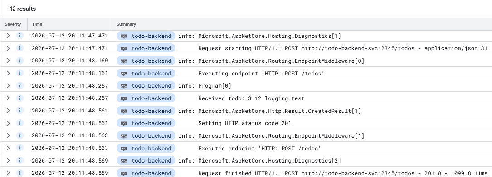

# DevOps with Kubernetes

This repository contains the applications built during the course exercises. Each exercise's app lives in its own directory, and each exercise is tagged as a GitHub release.

| Part 1 | Part 2 | Part 3 | Part 4 |
|---|---|---|---|
| [1.1](https://github.com/JJnne/devops-with-kubernetes-2026/releases/tag/1.1) | [2.1](https://github.com/JJnne/devops-with-kubernetes-2026/releases/tag/2.1) | [3.1](https://github.com/JJnne/devops-with-kubernetes-2026/releases/tag/3.1) | [4.1](https://github.com/JJnne/devops-with-kubernetes-2026/releases/tag/4.1) |
| [1.2](https://github.com/JJnne/devops-with-kubernetes-2026/releases/tag/1.2) | [2.2](https://github.com/JJnne/devops-with-kubernetes-2026/releases/tag/2.2) | [3.2](https://github.com/JJnne/devops-with-kubernetes-2026/releases/tag/3.2) | [4.2](https://github.com/JJnne/devops-with-kubernetes-2026/releases/tag/4.2) |
| [1.3](https://github.com/JJnne/devops-with-kubernetes-2026/releases/tag/1.3) | [2.3](https://github.com/JJnne/devops-with-kubernetes-2026/releases/tag/2.3) | [3.3](https://github.com/JJnne/devops-with-kubernetes-2026/releases/tag/3.3) | [4.3](https://github.com/JJnne/devops-with-kubernetes-2026/releases/tag/4.3) |
| [1.4](https://github.com/JJnne/devops-with-kubernetes-2026/releases/tag/1.4) | [2.4](https://github.com/JJnne/devops-with-kubernetes-2026/releases/tag/2.4) | [3.4](https://github.com/JJnne/devops-with-kubernetes-2026/releases/tag/3.4) | [4.4](https://github.com/JJnne/devops-with-kubernetes-2026/releases/tag/4.4) |
| [1.5](https://github.com/JJnne/devops-with-kubernetes-2026/releases/tag/1.5) | [2.5](https://github.com/JJnne/devops-with-kubernetes-2026/releases/tag/2.5) | [3.5](https://github.com/JJnne/devops-with-kubernetes-2026/releases/tag/3.5) | [4.5](https://github.com/JJnne/devops-with-kubernetes-2026/releases/tag/4.5) |
| [1.6](https://github.com/JJnne/devops-with-kubernetes-2026/releases/tag/1.6) | [2.6](https://github.com/JJnne/devops-with-kubernetes-2026/releases/tag/2.6) | [3.6](https://github.com/JJnne/devops-with-kubernetes-2026/releases/tag/3.6) | [4.6](https://github.com/JJnne/devops-with-kubernetes-2026/releases/tag/4.6) |
| [1.7](https://github.com/JJnne/devops-with-kubernetes-2026/releases/tag/1.7) | [2.7](https://github.com/JJnne/devops-with-kubernetes-2026/releases/tag/2.7) | [3.7](https://github.com/JJnne/devops-with-kubernetes-2026/releases/tag/3.7) | |
| [1.8](https://github.com/JJnne/devops-with-kubernetes-2026/releases/tag/1.8) | [2.8](https://github.com/JJnne/devops-with-kubernetes-2026/releases/tag/2.8) | [3.8](https://github.com/JJnne/devops-with-kubernetes-2026/releases/tag/3.8) | |
| [1.9](https://github.com/JJnne/devops-with-kubernetes-2026/releases/tag/1.9) | [2.9](https://github.com/JJnne/devops-with-kubernetes-2026/releases/tag/2.9) | [3.9](https://github.com/JJnne/devops-with-kubernetes-2026/releases/tag/3.9) | |
| [1.10](https://github.com/JJnne/devops-with-kubernetes-2026/releases/tag/1.10) | [2.10](https://github.com/JJnne/devops-with-kubernetes-2026/releases/tag/2.10) | [3.10](https://github.com/JJnne/devops-with-kubernetes-2026/releases/tag/3.10) | |
| [1.11](https://github.com/JJnne/devops-with-kubernetes-2026/releases/tag/1.11) | | [3.11](https://github.com/JJnne/devops-with-kubernetes-2026/releases/tag/3.11) | |
| [1.12](https://github.com/JJnne/devops-with-kubernetes-2026/releases/tag/1.12) | | [3.12](https://github.com/JJnne/devops-with-kubernetes-2026/releases/tag/3.12) | |
| [1.13](https://github.com/JJnne/devops-with-kubernetes-2026/releases/tag/1.13) | | | |

## 3.9: DBaaS vs DIY

Cloud SQL (DBaaS) requires very little setup - a managed Postgres instance is a few clicks or commands away, and it comes with automatic patching, high availability, and point-in-time backups out of the box. The tradeoff is that you pay for the instance continuously, regardless of usage, and you're locked into GCP's managed offering.

Running our own Postgres on a PVC, as we've done so far, only costs the price of the underlying disk, and it's portable to any Kubernetes cluster since it's just a plain Postgres image. The tradeoff is that we did all the setup ourselves, and we're responsible for maintenance and backups too. There's no automatic backup here - we'd need to script something like a CronJob running pg_dump to a bucket ourselves.

For this course, the DIY approach makes sense given the low cost and the fact that it's already working. For a production workload, I'd lean towards Cloud SQL mainly for the backup and restore story.

## 3.12: GKE logging

GKE ships container stdout/stderr to Cloud Logging automatically. Below is the log entry for a new todo being created, found via Kubernetes Engine > Workloads > todo-backend-dep > Logs:



## 4.3: Prometheus

Installed prometheus-community/prometheus via Helm into a monitoring namespace on the local k3d cluster, then port-forwarded the service (`kubectl port-forward svc/prom-prometheus-server -n monitoring 9090:80`) to reach the GUI at `http://localhost:9090`.

Query used to find pods created by StatefulSets in the monitoring namespace:

```
kube_pod_info{namespace="monitoring", created_by_kind="StatefulSet"}
```
